## End To End Test
The goal of this package is to setup automated E2E tests to check the platform web app for every pull request and against a new release.

## Technologies used
Playwright

## Testing Pattern
- User flow based testing
- [Page Object Model](https://testomat.io/blog/page-object-model-pattern-javascript-with-playwright/)

## How to setup
- `yarn install`
- `yarn playwright install` (to install playwright browser dependencies)
- `yarn dev:test:platform:e2e` (to run the test locally)
- `cd ./packages/platform-test && npx playwright test --ui ` (To run the tests in UI mode)

## Notes on Testing Github Workflow Locally

The workflow can be tested locally by installing [act](https://github.com/nektos/act).

To test the workflow:
- Install act: Follow the installation instructions at https://github.com/nektos/act
- Run the `test_workflow` script to execute the GitHub workflow locally

## Github Workflow 

```mermaid
gantt
    title E2E CI Workflow Timeline
    dateFormat X
    axisFormat %s
    
    section Trigger
    PR or Manual Dispatch :milestone, 0, 0
    
    section Parallel Jobs
    Extract Branch Name :extract, 0, 5
    Setup Netlify Deploy :crit, setup, 0, 10
    Install Dependencies :crit, after setup, 15
    Build Platform :crit, after setup, 20
    Deploy to Netlify :crit, after setup, 30
    
    section E2E Tests
    Wait for Dependencies :milestone, after extract deploy, 0
    Install Test Dependencies :test, after extract deploy, 10
    Install Playwright :after test, 15
    Run E2E Tests :active, after test, 25
```

## References.
- https://www.joranquinten.nl/tutorials/
- [running-e2e-test-suite-on-a-netlify-preview-url](https://www.joranquinten.nl/tutorials/running-e2e-test-suite-on-a-netlify-preview-url)
- https://snyk.io/es/blog/how-to-add-playwright-tests-pr-ci-github-actions/
- https://dev.to/thiernope/trigger-netlify-deploys-using-github-workflow-cicd-lcm
- https://github.com/nwtgck/actions-netlify/issues/1220
- https://testomat.io/blog/grouping-playwright-tests-for-improved-framework-efficiency/
- https://playwright.dev/docs/test-annotations For writing conditional tests