## End To End Test
The goal of this package is to setup automated E2E tests to check the platform web app for every pull request and against a new release.

## Technologies used
Playwright

## Folder Structure

```
packages/platform-test/
├── e2e/                          # Test files organized by page
│   └── pages/
│       ├── disease/              # Disease page tests
│       ├── drug/                 # Drug page tests
│       ├── study/                # Study page tests
│       ├── variant/              # Variant page tests
│       └── homepage.spec.ts      # Homepage tests
├── fixtures/                     # Test configuration and fixtures
│   ├── index.ts                  # Playwright fixture extensions
│   └── testConfig.ts             # Centralized test data configuration
├── POM/                          # Page Object Model implementation
│   ├── objects/                  # Reusable UI component interactors
│   │   ├── components/           # Shared components (headers, sections)
│   │   └── widgets/              # Feature-specific widgets (AOTF, evidence sections)
│   └── page/                     # Page-level abstractions
│       ├── disease/
│       ├── drug/
│       ├── study/
│       └── variant/
└── playwright.config.ts          # Playwright configuration
```

## Page Object Model

This project uses the **Page Object Model (POM)** pattern to create maintainable and reusable test code. Our POM implementation is organized into three layers:

### 1. **Page Objects** (`POM/page/`)
High-level page abstractions that represent entire pages and provide navigation methods.

```typescript
// Example: VariantPage
class VariantPage {
  goToVariantPage(variantId: string) { ... }
  getProfilePage() { ... }
}
```

### 2. **Component Objects** (`POM/objects/components/`)
Reusable UI components that appear across multiple pages (headers, evidence sections, etc.).

```typescript
// Example: EvidenceSection
class EvidenceSection {
  waitForSectionLoad(sectionId: string) { ... }
  isEvidenceSectionVisible(sectionId: string) { ... }
}
```

### 3. **Widget Objects** (`POM/objects/widgets/`)
Feature-specific, interactive components with complex behavior (tables, forms, drawers).

```typescript
// Example: AotfTable
class AotfTable {
  getDataCellsWithScores(rowIndex: number) { ... }
  clickDataCell(rowIndex: number, columnId: string) { ... }
}
```

### Best Practices

- **Prefer `data-testid` attributes** over generic selectors (classes, XPath) for stability and readability
  ```typescript
  // ✅ Good - uses data-testid
  page.locator("[data-testid='evidence-section-gwas']")
  
  // ❌ Avoid - fragile CSS selectors
  page.locator(".MuiBox-root .css-8b1dmf")
  ```

- Keep selectors in Page Objects, not in test files
- Return Locators or primitives, avoid complex logic in Page Objects
- One file per component/page for clarity

For more details on POM, see the [References](#references) section.

## Testing Different Behaviours with Fixtures

We use **Playwright fixtures** to manage test data and make tests flexible and maintainable. All test entity IDs are centralized in `fixtures/testConfig.ts`.

### Configuration Structure

```typescript
interface TestConfig {
  drug: {
    primary: string;              // Drug with comprehensive data
  };
  variant: {
    primary: string;              // Variant with GWAS data
    withMolecularStructure: string;
    withPharmacogenomics: string;
  };
  disease: {
    primary: string;
    name?: string;
    aotfGenes?: string[];         // Genes for AOTF table testing
  };
  study: {
    gwas: { primary: string };
    qtl?: { primary: string };
  };
}
```

### Using Fixtures in Tests

```typescript
test("Disease header is correctly displayed", async ({ page, testConfig }) => {
  // Use testConfig instead of hardcoded IDs
  await page.goto(`/disease/${testConfig.disease.primary}`);
  
  const diseaseName = page.getByTestId("profile-page-header-text");
  await expect(diseaseName).toHaveText(testConfig.disease.name);
});
```

### Benefits

- **Single source of truth** for test data
- **Easy to update** entity IDs without touching test files
- **Test different scenarios** by swapping configurations
- **Supports future external config** (API, environment variables)

## Annotating Critical Tests

We use Playwright's tagging system to identify **smoke tests** - critical tests that must pass before running the full suite.

### Marking Smoke Tests

Add `{ tag: '@smoke' }` to critical tests that validate core functionality:

```typescript
test("Homepage loads successfully", { tag: '@smoke' }, async ({ page }) => {
  await page.goto("/");
  const title = await page.title();
  expect(title).toBe("Open Targets Platform");
});
```

### Running Tests

```bash
# Run all tests
yarn dev:test:platform:e2e

# Run smoke tests only (fast feedback)
yarn dev:test:platform:e2e:smoke

# Run specific test file
npx playwright test e2e/pages/homepage.spec.ts
```

### CI Behavior

- **Pull Requests**: Automatically run smoke tests only (faster CI)
- **Manual Trigger**: Choose between `smoke` or `all` tests in GitHub Actions

## Testing Pattern
- User flow based testing
- [Page Object Model](https://testomat.io/blog/page-object-model-pattern-javascript-with-playwright/)

## How to setup
- `yarn install`
- `yarn playwright install` (to install playwright browser dependencies)
- `yarn dev:test:platform:e2e` (to run the test locally)
- `cd ./packages/platform-test && npx playwright test --ui ` (To run the tests in UI mode)

## Notes on Testing Github Workflow Locally

The workflow can be tested locally by installing [act](https://github.com/nektos/act).

To test the workflow:
- Install act: Follow the installation instructions at https://github.com/nektos/act
- Run the `test_workflow` script to execute the GitHub workflow locally

## Github Workflow 

```mermaid
gantt
    title E2E CI Workflow Timeline
    dateFormat X
    axisFormat %s
    
    section Trigger
    PR or Manual Dispatch :milestone, 0, 0
    
    section Parallel Jobs
    Extract Branch Name :extract, 0, 5
    Setup Netlify Deploy :crit, setup, 0, 10
    Install Dependencies :crit, after setup, 15
    Build Platform :crit, after setup, 20
    Deploy to Netlify :crit, after setup, 30
    
    section E2E Tests
    Wait for Dependencies :milestone, after extract deploy, 0
    Install Test Dependencies :test, after extract deploy, 10
    Install Playwright :after test, 15
    Run E2E Tests :active, after test, 25
```



## References
- [Page Object Model Pattern with Playwright](https://testomat.io/blog/page-object-model-pattern-javascript-with-playwright/) - Comprehensive guide on implementing POM in Playwright
- [Joran Quinten Tutorials](https://www.joranquinten.nl/tutorials/) - Playwright and testing tutorials
- [Running E2E Tests on Netlify Preview URL](https://www.joranquinten.nl/tutorials/running-e2e-test-suite-on-a-netlify-preview-url) - Guide for integrating Playwright with Netlify deployments
- [Adding Playwright Tests to GitHub Actions CI](https://snyk.io/es/blog/how-to-add-playwright-tests-pr-ci-github-actions/) - CI/CD integration tutorial
- [Triggering Netlify Deploys with GitHub Workflows](https://dev.to/thiernope/trigger-netlify-deploys-using-github-workflow-cicd-lcm) - Netlify automation guide
- [Actions Netlify Issue #1220](https://github.com/nwtgck/actions-netlify/issues/1220) - Discussion on Netlify GitHub Actions integration
- [Grouping Playwright Tests](https://testomat.io/blog/grouping-playwright-tests-for-improved-framework-efficiency/) - Test organization strategies
- [Playwright Test Annotations](https://playwright.dev/docs/test-annotations) - Official documentation for conditional tests and tagging
