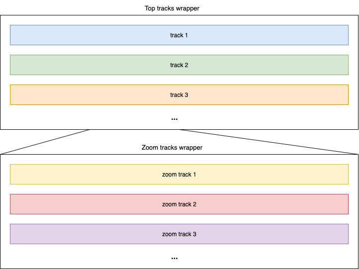
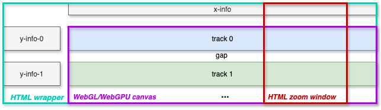

# GenTrack

Flexible 1D-tracks for showing genetic (and related) data.

## Idea



- A __track__ can be used to show anything drawn in a Pixi.js container, e.g. sequence track (colored rectangles), line plot, arrows, etc.
  
- Tracks in the same wrapper share a canvas and x-scale.

- Zoomed track correspond to a window on the outer wrapper's x-scale.

## Design

__Note:__ The diagram below is outdated - the zoom window now has its own HTML container located between the top-level tracks and the zoomed tracks.



- The top-level tracks are drawn on the same cavas. The zoomed tracks are drawn on a second canvas. All tracks on the same canvas will share an x-scale.

- We can write a single `GenTrack` component to use for both sets of tracks. Fixed x-limits can be used for the top tracks whereas the x-limits of the zoomed tracks will be dictated by the zoom window.

- Everything outside the two canvases will HTML/SVG.

- Everything is React - tracks are written in [`@pixi/react`](https://react.pixijs.io/).

- Any combination of tracks can be used at the top-level and the zoom-level - a track can (but need not) be used at both levels. It is fine to use no tracks at the top-level (zoomable tracks only) or have no zoomable tracks.

## Components

#### `GenTrackProvider`

Provides context for the track. Its children should include a single `GenTrack` component along with any other components that need to get/set the context.

| Prop           | Type     | Default    | Description                                                                                                                                                                        |
| -------------- | -------- | ---------- | ---------------------------------------------------------------------------------------------------------------------------------------------------------------------------------- |
| `initialState` | `object` | `{}`       | Initial state that is merged with the 'base' state properties below.                                                                                                               |
| `reducer`      |          | `function` | A reducer function describing valid state changes. Passed the state and an action object. Should return a new state object. The reducer is 'merged' with the 'base' reducer below. |

**Note**: Reducer actions should start by shallow copying the state to ensure the base state properties descibed below are not discarded.

Base state properties:

| Name   | Type     | Default | Description                           |
| ------ | -------- | ------- | ------------------------------------- |
| `data` |          |         | Data to be displayed by the gen track |
| `xMin` | `number` | `0`     | Minimum x value.                      |
| `xMax` | `number` | `100`   | Maximum x value.                      |

The reducer function passed to the provider is augmented with action types to set the base properties:

- `setData`
- `setXMin`
- `setXMax`

Inside a `GenTrackProvider`, we typically fetch/request the data, then when it loads, use `setData` and also `setXMin` and `setXMax` - which usually depend on the data.

Any component inside a `<GenTrackProvider>` can import the following (from the same file as the provider comes from):

- `useGenTrackState`: get the state object.
- `useGenTrackDispatch`: dispatch function for changing state - passed an action object.

__Note:__ The code wrapping the gen track can use `useGenTrackDispatch` but should not consume the state (i.e. use `useGenTrackState`) whereas content inside the `GenTrack` can use the state but should not use the dispatch.

#### `GenTrack`

Top-level gen track component. This contains the x-info and tracks (each of which contains its own y-info). A `GenTrack` component should be inside a `GenTrackProvider` - and a `GenTrackInnerProvider` if showing inner tracks.

| Prop                | Type        | Default        | Description                                                                                                         |
| ------------------- | ----------- | -------------- | ------------------------------------------------------------------------------------------------------------------- |
| `tracks`            | `Track[]`   |                | Tracks.                                                                                                             |
| `XInfo`             | `component` |                | React component to show info about the shared x scale - e.g. a label and axis. Should take `start` and `end` props. |
| `Tooltip`           | `component` |                | Tooltip - see [Tooltip](#tooltip).                                                                                  |
| `tooltipProps`      | `object`    |                | Additional tooltip options: `xAnchor`, `yAnchor`, `dx`, `dy`.                                                       |
| `innerTracks`       | `Track[]`   |                | Inner tracks.                                                                                                       |
| `InnerXInfo`        | `component` |                | React component to show info about the shared x scale - e.g. a label and axis. Should take `xMin` and `xMax` props. |
| `InnerTooltip`      | `component` |                | Tooltip for inner tracks - see [Tooltip](#tooltip).                                                                 |
| `innerTooltipProps` | `object`    |                | Additional inner tooltip options: `xAnchor`, `yAnchor`, `dx`, `dy`.                                                 |
| `yInfoWidth`        | `number`    | `160`          | Space on left reserved for y-info of tracks.                                                                        |
| `yInfoGap`          | `number`    | `16`           | Horizontal space between yInfo components and tracks.                                                               |
| `panZoomTopGap`     | `number`    | `16 `          | Vertical space above pan-zoom panel.                                                                                |
| `panZoomBottomGap`  | `number`    | `16 `          | Vertical space below pan-zoom panel.                                                                                |
| `zoomLines`         | `boolean`   | `false `       | Indicate zoom window on top-level canvas.                                                                           |
| `initialZoom`       | `number[]`  | `[xMin, xMax]` | Initial limits for pan-zoom window. Should be within the x-limits used for the top-level tracks.                    |

A `GenTrack` fills the width of its parent container.

#### Tracks

The `tracks` prop of a `GenTrack` should be passed an array of objects, where each object has the form:

| Property     | Type        | Default | Description                                                                                                                                                                                                                  |
| ------------ | ----------- | ------- | ---------------------------------------------------------------------------------------------------------------------------------------------------------------------------------------------------------------------------- |
| `id`         | `string`    |         | Unique id for the track. Typically a readable name, e.g. `'domains'`.                                                                                                                                                        |
| `yMin`       | `number`    | `0`     | Minimum y value for y-scale.                                                                                                                                                                                                 |
| `yMax`       | `number`    | `100`   | Maximum y value for y-scale.                                                                                                                                                                                                 |
| `YInfo`      | `component` |         | Is rendered inside a container with width equal to the `InfoWidth` of the parent `GenTrack` and height equal to `height`.                                                                                                    |                                                    |
| `Track`      | `component` |         | Should return a Pixi container. The container is vertically translated to the appropriate part of the canvas, stretched to the width of the canvas, given height equal to `height` and given the appropriate x and y scales. |                                                    |
| `height`     | `number`    | `50`    |
| `paddingTop` | `number`    | `0`     | Gap above track.                                                                                                                                                                                                             | Height of `YInfo` container and `Track` container. |

Inside a `Track`, it is standard to access the relevant context: `useGenTrackState`.

`YInfo` components belonging to an outer `GenTrack` can set the outer or inner state (`useGenTrackDispatch` and `useGenTrackInnerDispatch`). `YInfo` components inside an inner `GenTrack` can access the outer state (`useGenTrackState`).

#### Tooltip

Use the `Tooltip` and `InnerTooltip` properties of the `GenTrack` component to pass tooltip components for top-level and inner tracks respectively.

If using `Tooltip` or `InnerTooltip`, wrap the GenTrack content in a `GenTrackTooltipProvider`, e.g.

```jsx
<GenTrackProvider initialState={{ data, xMin: 200, xMax: 700 }} >
  <GenTrackTooltipProvider >
    <BodyContentInner data={data} />
  </GenTrackTooltipProvider>
</GenTrackProvider>
```

Inside the component where the tracks are defined, get the tooltip dispatch function:

```js
const genTrackTooltipDispatch = useGenTrackTooltipDispatch();
```

When drawing with Pixi, use `eventMode: "static"` to make sprites/objects interactive. Also add event handlers which use the dispatch function to set any of the `datum`, `otherData` and `globalXY` properties of the tooltip context. E.g.

```jsx
<Sprite
  eventMode="static"
  pointerover={e => {
    genTrackTooltipDispatch({ type: "setDatum", value: d });
    genTrackTooltipDispatch({ type: "setGlobalXY", value: { x: e.global.x, y: e.global.y } });
  }}
  pointerout={e => {
    genTrackTooltipDispatch({ type: "setDatum", value: null });
    genTrackTooltipDispatch({ type: "setGlobalXY", value: null });
  }}
  // ... other Sprite props
/>
```

Inside the tooltip component passed to `GenTrack`, access the tooltip context as required. E.g.

```jsx
function MyTooltip() {
  const { datum } = useGenTrackTooltipState() ?? {};
  if (!.datum) return null;
  return (
    <Box sx={{ p: 0.5, border: "1px solid #bbb", borderRadius: 2, bgcolor: "#fff" }}>
      {JSON.stringify(datum)}
    </Box>
  );
}
```

#### Features To Add

- Crosshairs option on hover. Ideally ink vertical crosshairs so they show on both canvases.

- Allow 'x-tracks' for overlays over multiple tracks. E.g. to highlight a region or to show lines linking enhancers in one track to genes in another.

- Tooltip position currently at mouse position. Allow passing e.g. a `position` prop:  a functoin with access to data, otherData, globalXY as well as scales to get from data->canvas coodinates.

- Highlight datum that tooltip is hovering on? Possibly tough since store this in a context where as should store manually for Pixi to see?

#### Bugs/Issues

- Is the initial width of the inner tracks canvas sometimes too narrow? - then coorects after first interaction with zoom window?

- Can XInfo/YInfo show contents overflowing. Will likely need this for e.g. axis labels at limits.

#### Notes

- __Important__: switched order that spread `extraStateProperties` and `initialState` in `createScopedContext`.tsx so that can initialise extra state properties when create the provider. Make sure happy this is appropriate and does not break any existing use of `createScopedContext`.

- Could investigate `pixi-viewport` for zooming, panning etc. and 'culling' for allowing inexpensive unseen elements.

- Data

  - Should process data as much as possible so not redoing it on redraw.
  
  - Need to consider file formats, dynamic fetching/streaming etc. but leave this until later.

- There are existing libraries, but they tend to be large and overkill for what we need (e.g. HiGlass and libraries that use it like Gosling.js(?), use SVG or basic canvas (so performance issues likely) or not particularly popular or frequently updated. Using Pixi.js will give us full flexibility and integration into React while still being quite high-level (for a WebGL library) and high performance.
